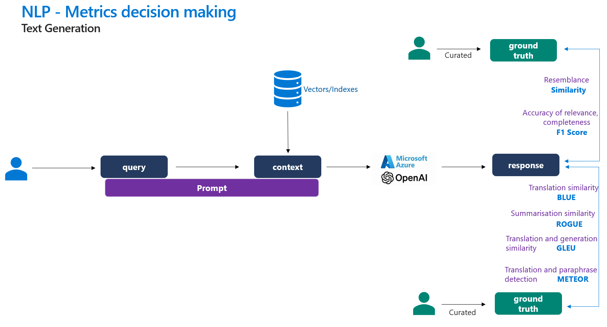

# Evaluate NLP based metrics generative AI
## Overview
Reference-based metrics are used to compare generated text to a reference, the human annotated ground truth text. Many of these metrics were developed for traditional NLP tasks before LLMs were developed but remain applicable to LLM-generated text.

# Quantitative evaluation metrics
- F1 Score: F1 score measures the similarity by shared tokens between the generated text and the ground truth, focusing on both precision and recall.
- BLEU Score: Measures the precision of n-grams in the translated text compared to a reference text
- ROUGE Score - Evaluates the recall of n-grams in the generated text against a reference text
- GLEU Score - Combines precision and recall to evaluate the quality of the generated text
- METEOR Score - Considers precision, recall, and alignment of words to assess the generated text

Set up will be same as in Lab1

## Lab
This lab use a NLP-assited single aoai model endpoints for evaluation in nlp_evaluators.ipynb. We use example ground-truth and response using your own model deployment to output a score. Explore the how the score changes on changing the responses and ground truth.

NLP results in AI Foundry

In addition, we expore multiple aoai models comparative evaluation framework in nlp_base_model_evaluators.ipynb to understand which model yields accurate results on quantitative metrics. The sample dataset we use in this excercise is nlp_data.jsonl and ai_data.jsonl.

We have a set of note books for each scenario. Each notebook are independent from each other so you can choose to run 

| Notebook                                        | Description                                               |
|-------------------------------------------------|-----------------------------------------------------------|
|[Single_Model_NLP_Evaluation](nlp_evaluators.ipynb)     | Prompt-based NLP-assisted evaluation using single model deployment|
|[Multiple_Model_AI-assisted_Evaluation](nlp_base_model_evaluators.ipynb) | Evaluate NLP metrics for multiple models concurrently with the same prompt and context using example curated dataset that |
